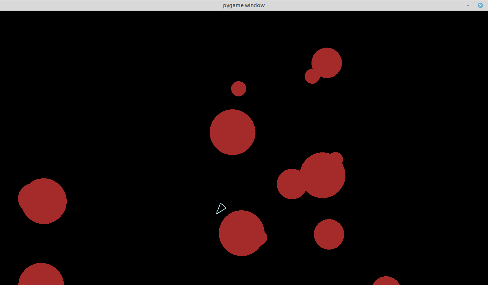

# Pygame Asteroids Learning Project

## 🚨 Disclaimer 🚨

> - There's a non-zero chance I have no idea how some parts of this actually work 😅
> - Some solutions might be... let's say "creatively implemented" 🎨
>   Remember: This is a learning project, not a NASA space mission control system.
>   Feel free to learn from my successes (and probably more from my mistakes)!

## About This Project

This is an implementation of the classic Asteroids game, created as part of the Backend Development Course at [Boot.dev](https://boot.dev). The project helped me learn:

- Python and OOP fundamentals
- Game development with Pygame
- Basic physics and collision detection

## Screenshots


*Avoiding certain death while shooting space rocks* 😅

### What's Going On Here?

1. You control a spaceship (hopefully without crashing)
2. Asteroids float around menacingly
3. When shot, bigger asteroids split into smaller ones (because physics!)
4. Small asteroids disappear when shot (they're shy)

### File Structure

```
pygame/
├── main.py           # Game mechanics and initializations
├── asteroid.py       # Where asteroids learn to split and cause chaos
├── circleshape.py    # The shape-y parent of all round things
├── constants.py      # Numbers that seemed right at the time
└── [other files]     # Various supporting acts
```

### Key Features

1. **Asteroid Splitting**: Vector math in action (mostly working!)
2. **Collision Detection**: Circles bumping into circles (usually correctly)
3. **Movement System**: Vectors, rotation, and inertia (or something like it)

## Running the Game

1. Make sure you have Python and Pygame installed
2. Run `python main.py`
3. If it works, great! If not, welcome to programming!

### Controls

- Arrow keys: Move ship
- Space: Shoot
- Shift: Boost
- Other keys: Probably don't do anything, but feel free to try!

### Known "Features" (aka Bugs)

- Sometimes asteroids might decide to have a party off-screen
- Collision detection occasionally takes coffee breaks
- Physics might occasionally forget how physics works

## License

Feel free to use this code for learning, teaching, or as an example of what not to do!
